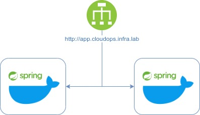
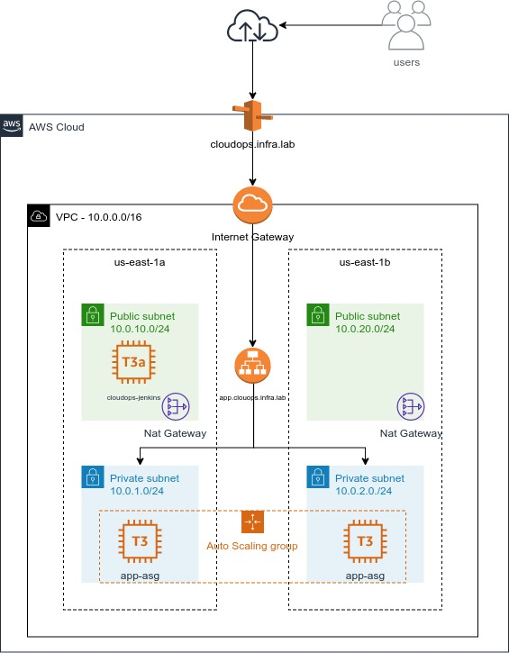
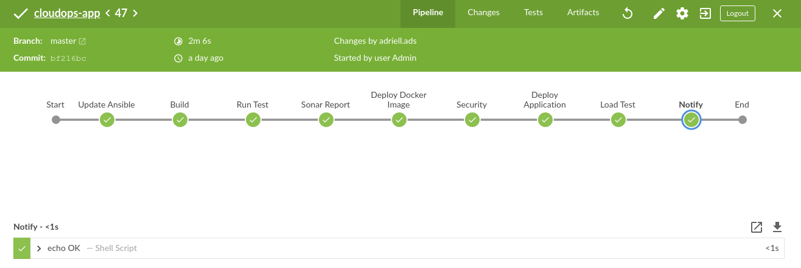

# CloudOps

Esta é uma implementação de uma arquitetura na AWS para hospedar uma aplicação spring boot utilizando [Terraform](https://www.terraform.io/docs/index.html),  [Terragrunt](https://terragrunt.gruntwork.io/docs/), [Docker](https://docs.docker.com/), [Ansible](https://docs.ansible.com/) e [Jenkins](https://www.jenkins.io/sigs/docs/).
Abaixo o desenho funcional da aplicação:

É uma aplicação java com [Spring boot](https://spring.io/projects/spring-boot), hospedada em container docker dentro de ec2, que recebe uma requisição http e retorna a mensagem: `#CloudOps :)`

[Código da Aplicação](https://github.com/adriell/cloudops-app)

Abaixo o desenho da arquitetura de infraestrutura construída para hospedar essa aplicação:

Foi utilizado a infraestrutura da AWS para hospedar a aplicação informada anteriormente. Como é possivel perceber a infraestrutura foi desenvolvida dentro de uma vpc `10.0.0.0/16`com duas subnets públicas e duas subnets privadas, com Nat Gateway, ALB e cloudops-jenkins em subnet pública e apenas a aplicação dentro de duas ec2 com auto scaling, em subnet privada com saída para internet através do Nat Gateway. Foi criado uma zona privada chamada cloudops.infra.lab e um record alias app.cloudops.infra.lab apontado para o alb. 

*Obs: O jenkins está na subnet pública pois nesta implementação, não foi criado nenhum mecanismo para acessá-la internamente, como por exemplo VPN.*

# Tecnologias Utilizadas
Abaixo o detalhamento de todas as tecnologias utilizadas nesse projeto.

## Infraestrutura como Código

### Terragrunt (Terraform)

O Terragrunt é um wrapper do terraform, que prover ferramentas extras para manter o código completamente DRY, facilitando o desenvolvimento de módulos terraform e gerenciando automaticamente o remote state. Segue o link para maiores informações: [Terragrunt](https://terragrunt.gruntwork.io/docs/).

No projeto foi utilizado a seguinte estrutura do código terraform e terragrunt:

Como é possível perceber existem 3 diretorios importantes para o desenvolvimento de um código reutilizável, dentro do diretório terraform :
- Terraform Modules (terraform-modules): é o diretório onde é desenvolvido o módulo base para cada componentes da infraestrutura a ser provisionada. Neste projeto existem os módulos:
  - terraform-module-alb: modulo para provisionar um Aplication Load Balancer (ALB).
  - terraform-module-asg: módulo para provisionar Auto Scaling Group(ASG).
  - terraform-module-ec2: módulo para provisionar uma ec2 dentro de qualquer tipo de subnet.
  - terraform-module-route53: módulo para provisionar uma zona de domínio privada.
  - terraform-module-sg: módulo para provisionar Security Groups (SG).
  - terraform-module-vpc: módulo para provisionar uma VPC.

- Terraform Blueprints (terraform-blueprints): é o diretório que armazena as implementações de cada módulo base, com algumas customizações.
  - terraform-blueprint-alb: blueprint do módulo base de ALB, nesse caso sem nenhuma customização.
  - terraform-blueprint-app: blueprint que implementa diversos módulos, todos com a finalidade de provisionar uma infraestrutura para hospedar uma aplicação. Nessa implementação tem os seguintes módulos bases: SG, ALB com listener rule para http, ASG e uma customização do Route 53, que adiciona alias record direcionando para o ALB.
  - terraform-blueprint-dns: módulo para provisionar uma ec2 dentro de qualquer tipo de subnet.
  - terraform-blueprint-ec3: módulo para provisionar uma zona de domínio privada.

- Terraform Live (terraform-live): é o diretório que tem o código do terragrunt, tendo como source, cada uma das blueprints criadas. O dirtório está organizado da seguinte maneira: `teraform-live > aws > us-east-1 > dev > implementações [alb, app, dns, vpc]`. Foram essas implementações que através do terraform e terragrunt que foi criado a arquitetura de infraestrutura citada no texto acima. 

### Ansible

O ansible é a ferramenta de automação que automatiza o provisionamento de cloud, gerenciamento de configuração, deploy de aplicação, orquestração de infraestrutura e qualquer outra coisa que a infraestrutura precisar. Segue o [link](https://docs.ansible.com/) para maiores informações.

No projeto foi utilizado as seguinte estrutura do código ansible:

- ansible: é o diretório raiz que armazena os demais diretórios do ansible, a playbook (local.yml) e o arquivo de configuração do ansible (ansible.cfg).
- inventory: é o diretório que armazena os arquivos de configuração de inventário dinamico: `ec2.ini`, `ec2.py` e `hosts`.
- roles: é o diretório que armazena as roles de instalação de todos os componentes que a aplicação vai precisar para ser executada. Tem-se as seguintes roles:
  - deploy: realiza o deploy da aplicação informada acima, em containers docker.
  - docker: instala e configura o docker.
  - jenkins: instala e configura o jenkins

## CI/CD

### Jenkins

É uma ferramenta open source que permite os desenvolvedores a realizar build, teste e deploy de suas aplicações. Mais informações basta clicar no [link](https://www.jenkins.io/sigs/docs/).
O jenkins foi utilizado a interface do Blue Ocean, que é na verdade uma nova experiencia de usuário projetado para utilizar com Jenkins Pipeline, mas ainda compatível com os modos Free Style.
A pipeline foi desenvolvido através do próprio arquivo do jenkins, `Jenkinsfile`, que está armazenada no repositório da aplicação. As steps desta pipeline são:

- Clone Repository: por mais que não mostre na imagem, a step é iniciada com o update do código da aplicação que será deployada. 
- Update Ansible: essa step faz o update do código ansible, que será utilizado na step de deploy.
- Build: aqui será realizada o build da aplicação com a utilização do [Maven](https://maven.apache.org/).
- Run Test: ainda utilizando o maven, esta step realiza os testes unitários. 
- Sonar Report: após realizado os testes unitários, todo o resultado será enviado para a ferramenta sonar, através da sua cloud [Sonar Cloud](https://sonarcloud.io/projects)
- Deploy Docker Image: essa é a etapa que será construida a imagem docker e a mesma será enviada para o repositório de imagens, o [Docker Hub](https://hub.docker.com/repository/docker/adriell/cloudops-app).
- Security: é uma step que faz um scan de segurança na imagem construída, visando garantir que a imagem não seja deployada com alguma vulnerabilidade de segurança. Para esta análise foi utilizada a ferramenta [Aqua MicroScanner](https://github.com/aquasecurity/microscanner#registering-for-a-token)
- Deploy Application: essa step realiza deploy da aplicação em container docker. Utiliza o ansible para realizar o deploy.
- Load Test: depois de deployado a aplicação, é realizado um teste de carga com a ferramenta [K6](https://k6.io/), visando garantir a performance da aplicação.
- Notify: por último e não menos importante, será realizado a notificação da conclusão do deploy.

## Container

### Docker

Docker é um container software, que fornece uma camada de abstração e automação para virtualização de um sistema operacional, usando isolamento de recurso do kernel do linux. Segue o [link](https://docs.docker.com/) para mais informações.
Para o projeto, a aplicação roda em container dentro da EC2.

# Link para os Repositórios
- [Aplicação](https://github.com/adriell/cloudops-app)
- [Docker Hub](https://hub.docker.com/repository/docker/adriell/cloudops-app)
- [Terraform Blueprints](https://github.com/adriell/terraform-blueprints)
- [Terraform Module ALB](https://github.com/adriell/terraform-module-alb)
- [Terraform Module ASG](https://github.com/adriell/terraform-module-asg)
- [Terraform Module EC2](https://github.com/adriell/terraform-module-ec2)
- [Terraform Module Route53](https://github.com/adriell/terraform-module-route53)
- [Terraform Module SG](https://github.com/adriell/terraform-module-sg)
- [Terraform Module VPC](https://github.com/adriell/terraform-module-vpc)

# Links para as ferramentas
- [Ansible](https://docs.ansible.com/)
- [Aqua MicroScanner](https://github.com/aquasecurity/microscanner#registering-for-a-token)
- [Docker](https://docs.docker.com/)
- [Jenkins](https://www.jenkins.io/sigs/docs/)
- [K6](https://k6.io/)
- [Maven](https://maven.apache.org/)
- [Sonar Cloud](https://sonarcloud.io/projects)
- [Spring boot](https://spring.io/projects/spring-boot)
- [Terraform](https://www.terraform.io/docs/index.html)
- [Terragrunt](https://terragrunt.gruntwork.io/docs/)